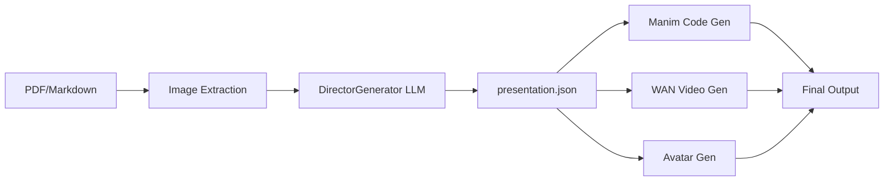
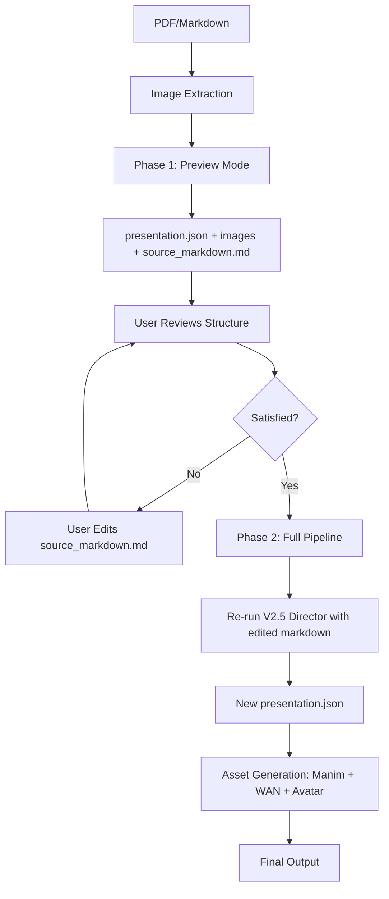

# V3 Human-in-Loop (HIL) Review Workflow - V2.5 Director Enhanced

## Overview

Implementing a two-phase workflow where users can review the generated presentation structure and **edit the source markdown** before expensive asset generation (avatars, Manim, WAN videos) begins.

**Key Insight**: Instead of complex comment injection, we simply let users edit `source_markdown.md` and re-run the existing V2.5 Director pipeline.

### Current V2.5 Pipeline



### Proposed HIL Workflow (SIMPLIFIED)



## User Review Required

> [!IMPORTANT]
> **Two Job IDs Strategy**:
> - **Preview Job** (`{job_id}_preview`): Generates presentation.json with images only, **NO asset generation, NO API calls to avatar/video services**
> - **Final Job** (original `{job_id}`): Re-runs V2.5 Director pipeline with edited `source_markdown.md` + generates all assets
>
> This is **V2.5 Director Bible enhanced with HIL approval**, not a new pipeline version.

> [!WARNING]
> **Breaking Change**: This adds a new `review_mode` parameter to the submit_job endpoint. Existing clients will default to normal mode (no review).

## Proposed Changes

### API Layer

#### [MODIFY] [app.py](file:///c:/Users/email/Downloads/AI-Document-presentation/ai-doc-presentation/api/app.py)

**Change 1: Add review_mode parameter to submit_job endpoint**
- Lines 280-527: Update `submit_job()` to accept `review_mode` parameter from form/JSON
- Add validation: `review_mode` can be `"preview"`, `"final"`, or `None` (default)
- Route to appropriate processor based on mode

**Change 2: Create new `/job/<job_id>/submit_review_and_regenerate` endpoint**
- Accepts user comments for each section
- Triggers Phase 2 (final generation) with comments injected into Director prompt
- Uses existing `run_job_async` infrastructure

**Change 3: Update existing `submit_review_endpoint` (lines 96-146)**
- Already saves reviews to `reviews.json` - reuse this!
- Enhancement: Add section-level comment structure

---

### Pipeline Layer

#### [MODIFY] [pipeline_unified.py](file:///c:/Users/email/Downloads/AI-Document-presentation/ai-doc-presentation/core/pipeline_unified.py)

**Change: Add `review_mode` and `user_comments` parameters**
- Update `process_markdown_unified()` signature (line 36)
- When `review_mode="preview"`:
  - Skip all asset generation (Manim, WAN, Avatar, TTS)
  - Only run Director LLM + image extraction
  - Save presentation.json with source images
- When `review_mode="final"`:
  - Pass `user_comments` dict to DirectorGenerator
  - Run full pipeline with all assets

---

### Director Generator Layer

#### [MODIFY] [unified_director_generator.py](file:///c:/Users/email/Downloads/AI-Document-presentation/ai-doc-presentation/core/unified_director_generator.py)

**Change: Inject user comments into Director prompts**
- Update `generate_presentation_loop()` (line 115) to accept `user_comments` parameter
- Modify system prompt dynamically to include:
  ```
  USER FEEDBACK FROM REVIEW:
  Section 3: "Add more visual emphasis on the Pythagorean theorem"
  Section 5: "Simplify the quiz question wording"
  ```
- Pass comments through to both Planner and Partition Director calls

---

### Image Processor Layer

#### [MODIFY] [image_processor.py](file:///c:/Users/email/Downloads/AI-Document-presentation/ai-doc-presentation/core/image_processor.py)

**Fix: Correct image extension in presentation.json**
- Line 147: Already converts to `.png` during save
- New function `fix_image_extensions_in_presentation()`:
  - Scan all `visual_content` entries in presentation.json
  - Replace `.jpeg` references with `.png`
  - Ensure consistency between file system and JSON references

---

### Data Models

#### [NEW] `reviews_schema.json`

Define structured review format:
```json
{
  "job_id": "abc123",
  "preview_job_id": "abc123_preview",
  "reviews": [
    {
      "section_id": 3,
      "section_type": "content",
      "section_title": "Introduction to Vectors",
      "user_comment": "Add more examples",
      "timestamp": "2026-01-25T19:30:00Z"
    }
  ],
  "approved_at": "2026-01-25T19:35:00Z",
  "status": "approved"
}
```

## Implementation Flow

### Phase 1: Preview Generation (Debug Mode)

**Endpoint**: `POST /submit_job` with `review_mode="preview"`

1. **Create Preview Job**:
   - Job ID: `{base_id}_preview`
   - Type: `v15_v2_preview`

2. **Run Limited Pipeline** (NO external API calls):
   ```python
   # Critical: This must NOT make any external API calls
   process_markdown_unified(
       markdown_content=content,
       review_mode="preview",
       skip_wan=True,       # Force skip - NO Kie.ai calls
       skip_avatar=True,    # Force skip - NO avatar API calls
       skip_manim=True,     # Force skip - NO Manim rendering
       generate_tts=False,  # Force skip - NO TTS generation
       # Only run: Image extraction + Director LLM
       ...
   )
   ```

3. **Output**:
   - `presentation.json` with complete structure
   - `images/` folder with source document images (.png)
   - `source_markdown.md`
   - Special marker in analytics.json: `"pipeline_mode": "preview"`

4. **UI Display**:
   - Player loads presentation.json
   - Shows structure, narration text, segment breakdown
   - Images display correctly
   - No videos/avatars (placeholder UI)
   - Review form per section

### Phase 2: Final Generation with Edited Markdown (SIMPLIFIED APPROACH)

**Endpoint**: `POST /job/<preview_job_id>/approve_and_generate`

**Request Payload**:
```json
{
  "edited_markdown": "# Updated content here...\n\nUser added this section...\n",
  "approved": true
}
```

**Process** (Much Simpler!):

1. **Receive Edited Markdown**:
   - User has edited their `source_markdown.md` via UI or direct file edit
   - Frontend sends the updated markdown content

2. **Create Final Job**:
   - Job ID: Use original `{job_id}` (not `_final` suffix)
   - Type: `v2.5_director_hil` (V2.5 Director Bible enhanced with HIL)
   - Save edited markdown as `source_markdown.md`

3. **Re-run Standard V2.5 Pipeline**:
   ```python
   # No special logic needed - just run normal pipeline!
   process_markdown_unified(
       markdown_content=edited_markdown,  # User's edited version
       review_mode="final",  # Flag to indicate this is post-review
       skip_wan=False,
       skip_avatar=False,
       generate_tts=True,
       # All normal V2.5 Director settings
       ...
   )
   ```

4. **No Prompt Injection Needed**:
   - The edited markdown IS the instruction
   - V2.5 Director reads it naturally
   - User has full control over content

5. **Full Asset Generation**:
   - Manim code generation
   - WAN video rendering
   - Avatar generation
   - TTS generation

6. **Output**:
   - Complete `presentation.json` (updated based on feedback)
   - All video assets
   - All audio assets
   - Avatar videos

## Why This Approach is MUCH Simpler

### ❌ Old Approach (Complex)
- Track comments per section
- Build comment injection system
- Engineer prompts to understand feedback
- Map section IDs to comments
- Risk: LLM might ignore or misinterpret comments

### ✅ New Approach (Simple)
- User edits markdown directly
- Re-run existing V2.5 pipeline
- No new prompt engineering
- No comment tracking
- User has full control

## Reusable Existing Functions

### ✅ Already Exists - No New Code Needed

| Function | Location | Purpose |
|----------|----------|---------|
| `submit_review_endpoint()` | `api/app.py:96` | ~~Save reviews to `reviews.json`~~ **NOT NEEDED - user edits markdown instead** |
| `extract_images_from_markdown()` | `core/image_processor.py:16` | Extract and save images as .png |
| `process_markdown_unified()` | `core/pipeline_unified.py:36` | Main pipeline orchestrator |
| `DirectorGenerator.generate_presentation_loop()` | `core/unified_director_generator.py:115` | Director LLM call |
| `run_job_async()` | `core/job_manager.py` | Async job execution |
| `setup_job_folder()` | `api/app.py:60` | Create job directory structure |

### 🆕 New Code Required (MINIMAL)

| Function | Location | Purpose |
|----------|----------|---------|
| `approve_and_generate()` | `api/app.py` (new endpoint) | Receive edited markdown + trigger Phase 2 |
| `fix_image_extensions()` | `core/image_processor.py` (new function) | Fix .jpeg → .png in JSON |

**That's it!** No comment tracking, no prompt injection needed.

## Image Extension Fix

### Current Issue

- Images are saved as `.png` (line 147 in image_processor.py)
- But presentation.json may reference them as `.jpeg`

### Solution

**New Function in `core/image_processor.py`**:

```python
def fix_image_extensions_in_presentation(presentation: dict) -> dict:
    """
    Ensure all image references use .png extension.
    """
    for section in presentation.get("sections", []):
        for segment in section.get("narration", {}).get("segments", []):
            visual = segment.get("visual_content", {})
            if visual.get("type") == "image" and "image_id" in visual:
                image_id = visual["image_id"]
                # Ensure .png extension
                if not image_id.endswith(".png"):
                    visual["image_id"] = image_id.replace(".jpeg", ".png").replace(".jpg", ".png")
    
    return presentation
```

**Call this after Director generation** in `pipeline_unified.py` before saving presentation.json.

## Verification Plan

### Automated Tests

1. **Preview Mode Test**:
   - Submit markdown with `review_mode="preview"`
   - Verify presentation.json exists
   - Verify NO videos/avatars generated
   - Verify images saved as .png

2. **Final Mode Test**:
   - Load preview job
   - Submit reviews via endpoint
   - Trigger final generation
   - Verify new presentation.json includes changes
   - Verify all assets generated

3. **Image Extension Test**:
   - Check all image references in presentation.json use `.png`
   - Verify files on disk are actually `.png`

### Manual Verification

1. User uploads PDF
2. Selects "Preview Mode"
3. Reviews generated structure in player
4. Adds comments to 2-3 sections
5. Approves and triggers final generation
6. Verifies final output includes feedback
7. Confirms all videos/avatars present

## Migration Strategy

### Backwards Compatibility

- Existing jobs continue to work (no `review_mode` = normal flow)
- New `review_mode` parameter is optional
- No database schema changes needed (uses existing job_manager)

### Rollout

1. Deploy code with `review_mode` support
2. Update UI to show "Preview" checkbox
3. Test with internal documents
4. Enable for all users
